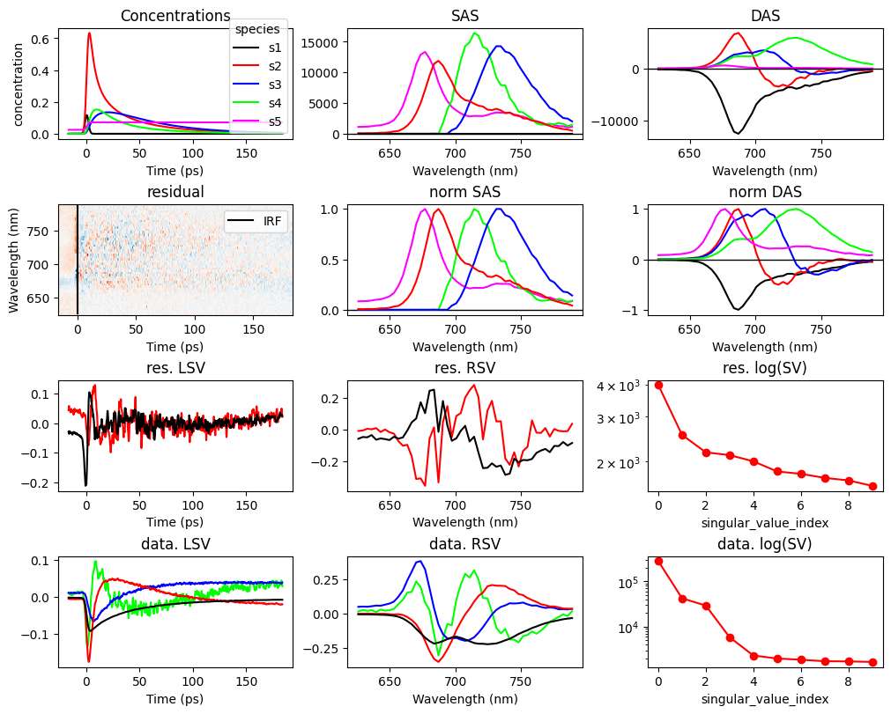

# pyglotaran

A framework for Global and Target Analysis written in Python.

## The Future of Global and Target Analysis

A scientific publication titled "pyglotaran: a lego-like Python framework for global and target analysis of time-resolved spectra" (DOI: [10.1007/s43630-023-00460-y](https://doi.org/10.1007/s43630-023-00460-y)) covers aspects of the architecture and the design of the software whille illustrating its flexibility as an analysis tool through some exciting case studies. This publication, along with other [pyglotaran-publications](https://github.com/glotaran/pyglotaran-publications) demonstrates why we believe this framework is the future of global and target analysis.

## Usage of pyglotaran

**Notice**: This is (still) an _early access_ release, please refer to the [usage notice](NOTICE.md#usage-notice) prior to committing to use pyglotaran to avoid surprises down the line.

A common use case for the framework is the analysis of time-resolved spectroscopy measurements in the study of energy transfer pathways in photosynthesis, or the characterization of energy transfer (in-)efficiencies in photovoltaics.

[in a nutshell] pyglotaran can be used from a Python script, or ideally Notebook, and involves specifying your desired analysis scheme consisting of a `model` and its `parameters` together with your `experiment_data`, and then letting it `optimize` this for you. This will fit your data while optimizing for the residuals given the model you specified, the constraints you specified therein, given the (free) parameters and its starting values you provided.

We have prepared a number of comprehensive examples in the form of python notebooks in the [pyglotaran-examples](https://github.com/glotaran/pyglotaran-examples) which illustrate how to use the framework. Download the example that best aligns with your use case, and give it go, and perhaps soon you will also be looking at a georgous breakdown of your data like this.

The results of a target analysis of Photosystem I (see [study_florescence](https://github.com/glotaran/pyglotaran-examples/tree/main/pyglotaran_examples/study_fluorescence) in the [examples](https://github.com/glotaran/pyglotaran-examples/tree/main/pyglotaran_examples).)

## Glotaran legacy

The pyglotaran package derives its name from the Glotaran software package (now called [glotaran-legacy](https://github.com/glotaran/glotaran-legacy)), first released in 2011 and described in a highly-cited publication in the Journal of Statistical Software, under the title [Glotaran: A Java-Based Graphical User Interface for the R Package TIMP](https://www.jstatsoft.org/article/view/v049i03) ([DOI: 10.18637/jss.v049.i03](https://dx.doi.org/10.18637/jss.v049.i03)).

The [pyglotaran](https://github.com/glotaran/pyglotaran) framework can be considered the spiritual successor of the [glotaran-legacy](https://github.com/glotaran/glotaran-legacy) software and has the backing of many of its original creators.

## Community Support

For questions / suggestion please reach out to us via:

1. [GitHub issues](https://github.com/glotaran/pyglotaran/issues)
2. [Discord](https://discord.gg/KfnEYRSTJx)
3. [Google-Groups mailing list](https://groups.google.com/forum/#!forum/glotaran)

## Credits

The credits can be found in the documentation
[authors section](https://pyglotaran.readthedocs.io/en/latest/authors.html)
