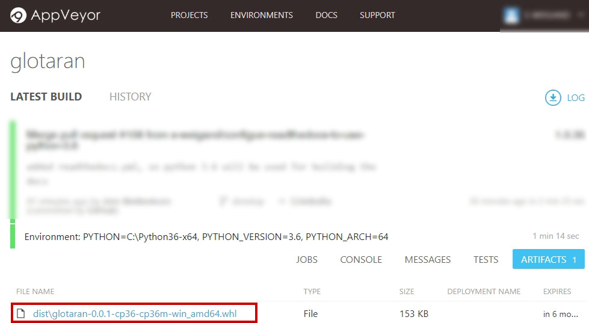

.. highlight:: shell

============
Installation
============

..
    Stable release
    --------------

    To install glotaran, run this command in your terminal:

    .. code-block:: console

        $ pip install glotaran

    This is the preferred method to install glotaran, as it will always install the most recent stable release.

    If you don't have `pip`_ installed, this `Python installation guide`_ can guide
    you through the process.

.. _pip: https://pip.pypa.io/en/stable/

..
    .. _Python installation guide: http://docs.python-guide.org/en/latest/starting/installation/

From sources
------------

The sources for glotaran can be downloaded from the `Github repo`_.

First you have to install the Setup dependencies:

.. code-block:: console

    $ pip install -U numpy scipy Cython

Afterwards you can simply use `pip`_ to install it directly from the `Github repo`_.

.. code-block:: console

    $ pip install git+https://github.com/glotaran/glotaran.git@develop --process-dependency-links

Or you can either clone the public repository:

.. code-block:: console

    $ git clone -b develop --single-branch git://github.com/glotaran/glotaran.git

Or download the `tarball`_:

.. code-block:: console

    $ curl  -OL https://github.com/glotaran/glotaran/tarball/develop

And once you have a copy of the source, you can install it with:

.. code-block:: console

    $ python setup.py install

Temporary workaround for Windows
--------------------------------

Since ``glotaran`` uses accelerator modules written in `Cython`_ for better peromance,
it might not be possible for you to install it, if you are missing the needed C compiler.

Which is why we created a temporary workaround for you to still enjoy the latest version of ``glotaran``,
until our build and deployment system is up and running.
Depending on your Python architecture (32bit/64bit) you can download ``glotaran for Python 3.6`` from our
`buildserver`_ as follows.

Once you are at the website of the `buildserver`_, you need to select the build job which did build the
installer for you architecture (32bit/64bit).

.. image:: images/appveyor_latest.jpg

When you are that the page of the job you need to select the ``ARTIFACTS`` tab.

.. image:: images/appveyor_artifact.jpg

And finally download the installer.

After you downloaded it you can simply install it with:

* 64bit::

    $ pip install --upgrade --force-reinstall git+https://github.com/glotaran/lmfit-varpro.git
    $ pip install glotaran-0.0.1-cp36-cp36m-win_amd64.whl

* 32bit::

    $ pip install --upgrade --force-reinstall git+https://github.com/glotaran/lmfit-varpro.git
    $ pip install glotaran-0.0.1-cp36-cp36m-win32.whl

.. note::  The reinstallation of ``lmfit-varpro`` is to ensure that you have the latest version,
           which is compatible with with the latest version of ``glotaran`` .

.. _Cython: http://cython.org/
.. _buildserver: https://ci.appveyor.com/project/jsnel/glotaran/branch/develop
.. _Github repo: https://github.com/glotaran/glotaran
.. _tarball: https://github.com/glotaran/glotaran/tarball/develop
